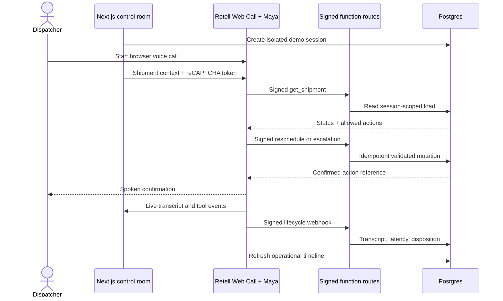

# FreightGuard AI architecture

Every browser receives an HTTP-only session cookie and a fresh copy of four synthetic loads. Shipment reads and writes require both the session ID and shipment ID, so demos cannot affect one another.

The browser sends Retell the session and shipment context as call metadata. Retell signs every tool request and webhook with `X-Retell-Signature`; the server verifies the raw request body before parsing it. Tool parameters are schema-validated, and business rules independently decide whether a load can be rescheduled or must be escalated.

Mutation fingerprints combine the Retell call ID, tool name, and canonical arguments. The receipt table returns completed responses on replay, rejects concurrent duplicates, and permits failed transient requests to be retried. The seeded “load not located” scenario deliberately fails its first mutation to demonstrate that behavior.

The public demo uses three abuse controls: a Retell public key, Retell’s reCAPTCHA v3 enforcement, and a production host allowlist. Configure allowed reCAPTCHA domains in Google and enable reCAPTCHA for the public key in Retell Public Keys settings.
